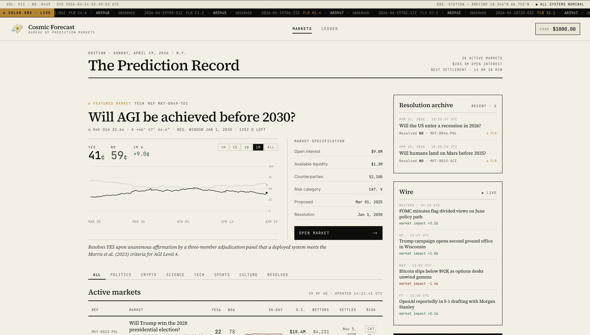

# Cosmic Forecast

A satirical prediction-market interface where bets are resolved by the cosmos. Users trade Yes/No shares on real-world questions, but outcomes aren't settled by reality — they're settled by whatever NASA's space-weather feed happens to report that day, then rationalized by an LLM pretending to be a rigorous research bureau.

Built as an NYU course project.



## Quick start

```bash
bun install
bun run dev        # http://localhost:3000
```

### Other scripts

```bash
bun run build      # production build
bun run lint       # Biome check
bun run format     # Biome format
bun run test       # Playwright e2e (excludes load tests)
bun run dev:https  # local HTTPS with mkcert certs in repo root
```

## How it works

1. Browse markets on the homepage, click Yes/No → `/market/[slug]?side=yes|no`
2. Place a bet. Balance deducts; the position is saved to localStorage.
3. A "Speed Up Time" overlay appears, leading into a warp-starfield animation.
4. During the animation two requests fire in parallel:
   - `POST /api/resolve-bet` — deterministically maps a live NASA DONKI event (solar flares, CMEs) to a YES/NO outcome for the market.
   - `POST /api/generate-explanation` — asks an OpenAI-compatible model to write a plausible-sounding cosmic rationale for that outcome.
5. The result reveals: outcome, P&L, and a fabricated scientific write-up.

There is no database, no auth, and no real money. Everything runs client-side with Next.js API routes in front of NASA and an LLM.

## Tech stack

- **Next.js 16.2.2** (App Router, Turbopack) — note: `params` / `searchParams` are async Promises
- **React 19** + TypeScript
- **Tailwind CSS v4** with `@theme inline`
- **zustand 5** (persist middleware → localStorage) — guard reads with `useHydrated()` to avoid SSR mismatches
- **motion/react** for animations
- **Biome** for lint + format
- **bun** as the package manager
- **OpenNext + Cloudflare Workers** as the deploy target

## Environment

```bash
OPENAI_API_KEY=
OPENAI_BASE_URL=
OPENAI_MODEL=
```

NASA DONKI does not require a key.

## Project layout

```
app/            # routes: home, /market/[slug], /resolution, /wallet, API routes
components/     # FeaturedMarket, PriceChart, SpeedUpOverlay, WarpAnimation, BettingPanel, ...
data/markets.json   # 40 seeded market questions
hooks/          # useHydrated, useMarketTicker, ...
lib/            # zustand store, fake-data generators, seeded price history
scripts/        # Bun-only utilities (excluded from tsconfig)
tests/          # Playwright specs
```

## Deploy (Cloudflare)

```bash
bun run preview    # local OpenNext preview
bun run deploy     # build + deploy via opennextjs-cloudflare
```
